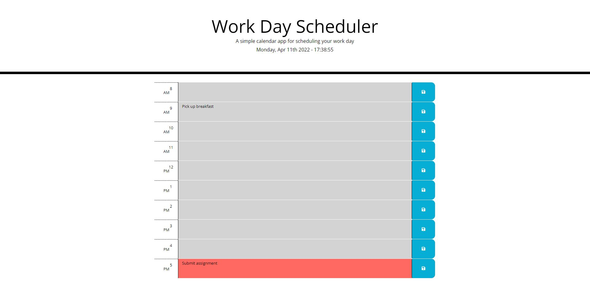

# Challenge 3 Work Day Scheduler

## Description

This project is intended to be a smiple lightweight workday scheduler which will allow you to save text data to a specified timeblock, and color code the time blocks to allow you to schedule your day. This

## Website

[Click Here](https://grayweling.github.io/work-day-scheduler/) to go to the website!

